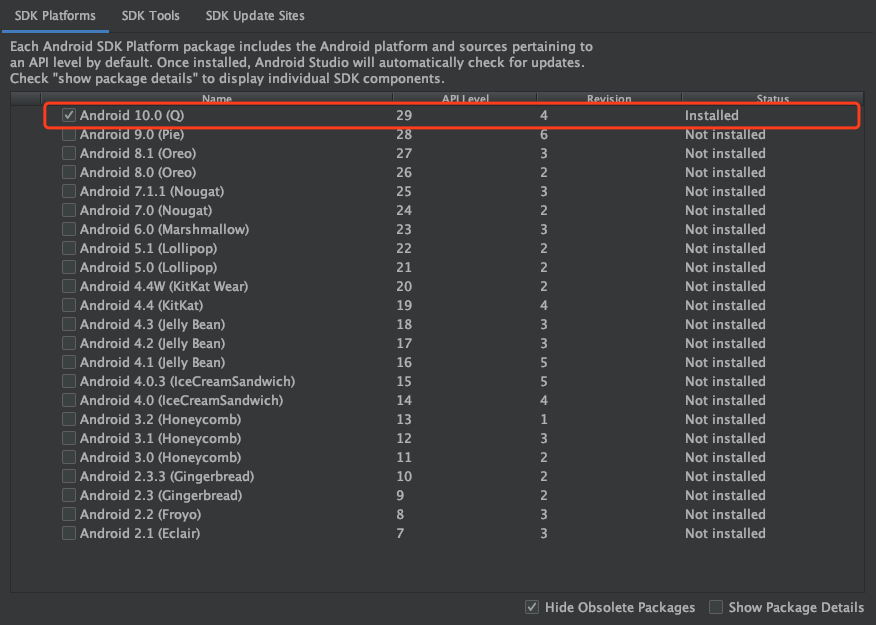
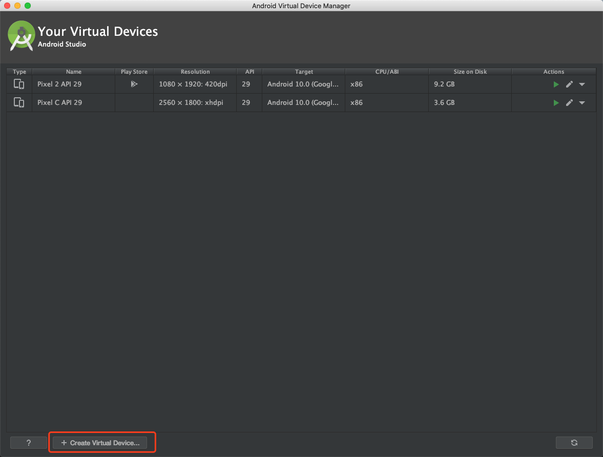
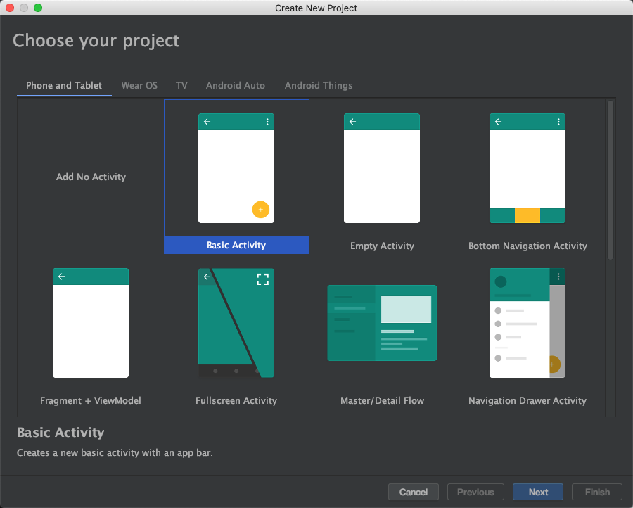
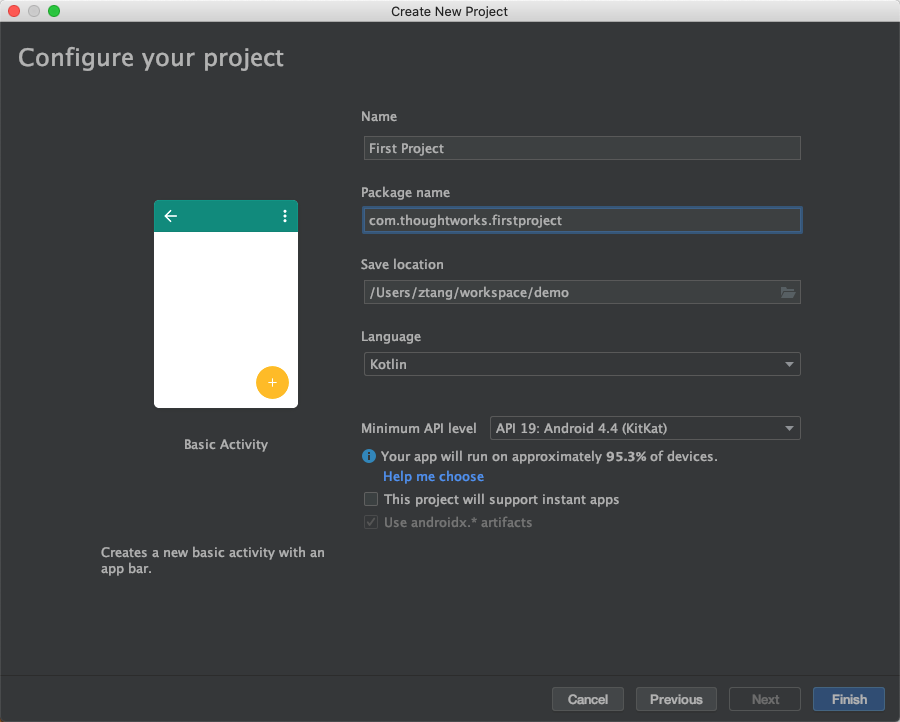
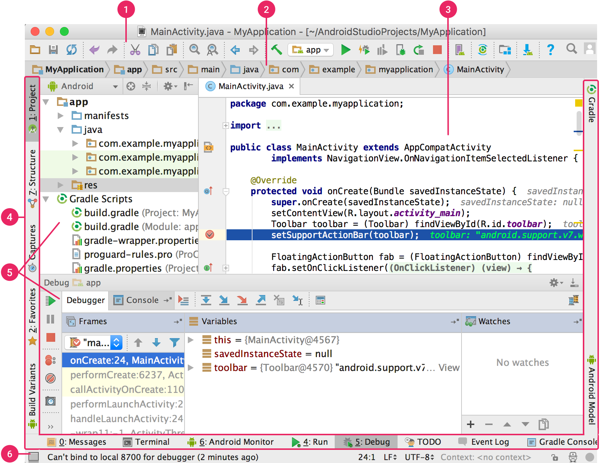
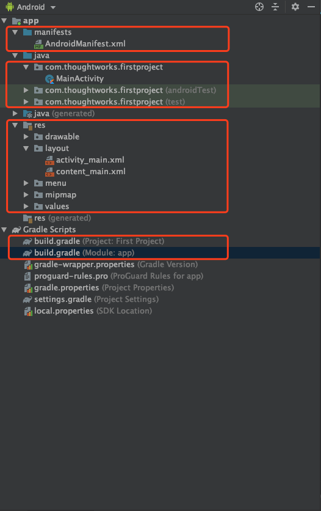
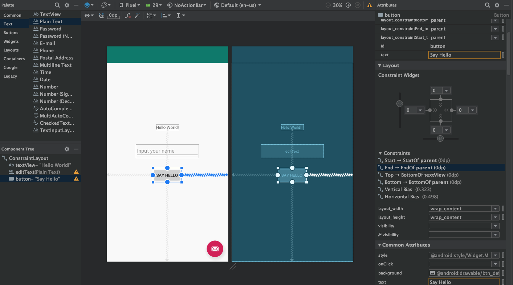
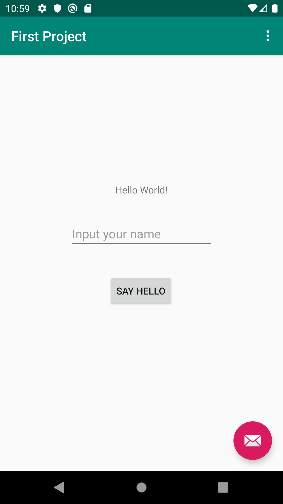

# Intro to Android Studio

The Android Studio provide everything you need to develop an Android application.

## Setup Android SDK and Simulator

- Download Android Studio from Android developer website. (Recommend use 3.6 preview or above)
- Android Platform (Recommend least version)

- SDK Tools

- Create simulator

## Walking through the Android Studio

### Create a new empty activity project

### Main Window of Android Studio

1. The toolbar lets you carry out a wide range of actions, including running your app and launching Android tools.
2. The navigation bar helps you navigate through your project and open files for editing. It provides a more compact view of the structure visible in the Project window.
3. The editor window is where you create and modify code. Depending on the current file type, the editor can change. For example, when viewing a layout file, the editor displays the Layout Editor.
4. The tool window bar runs around the outside of the IDE window and contains the buttons that allow you to expand or collapse individual tool windows.
5. The tool windows give you access to specific tasks like project management, search, version control, and more. You can expand them and collapse them.
6. The status bar displays the status of your project and the IDE itself, as well as any warnings or messages.

### Project Structure

1. The manifest file describes essential information about your app to the Android build tools, the Android operating system, and Google Play.
2. The source code of project, include product code and the test code.
3. Project resource, include the UI layout, images and some constant values.
4. Project gradle build config.

Then you can click the "Run" button on the toolbar, you should see simulator started and show a blank screen.

> More Android Studio introduce you can refer from site [Android Studio](https://developer.android.com/studio)

### Add some elements on to the screen

- Open the content_main.xml under layout resource.
  - Drag the `Plain Text` component at the below of Hello world text.
  - Select the `Plain Text` component, remove the text attribute and add hint text "Input your name".
  - Drag the `Button` component at the below of name text input component.
  - Select the `Button` component, and change the text to "Say Hello".

- Run the app, you should see the following screen in simulator.

### Add the click listener on the button

- Open the MainActivity class
  - Add code `button.setOnClickListener { textView.text = "Hello ${editText.text}!" }` at the bottom of `onCreate` method.
  - Tips, when first you type the button, IDE will show error and say "Unresolved reference: button", you can hit `Alt+Enter`, IDE will auto import the layout reference.

- Run the app, type you name into text box, hit the button, you will see the text updated.

## What's next?

- Enough of the Kotlin language to get you going
- Retrieving data from the network
- Displaying listings in a scrolling table
- Testing and debugging your application

## Further reading

- Android Studio documentation https://developer.android.com/studio/intro
- Android Studio keymap https://developer.android.com/studio/intro/keyboard-shortcuts
