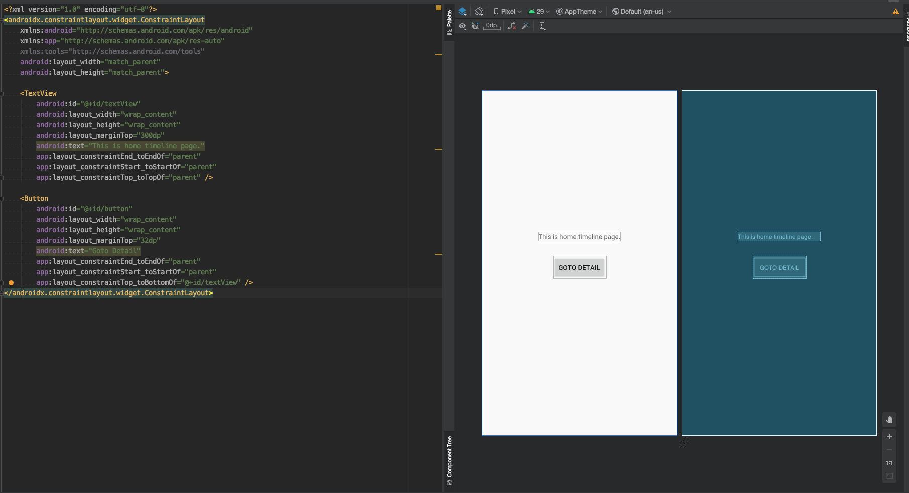
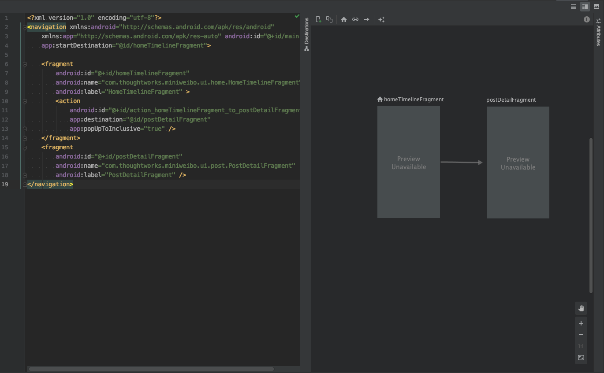

# Navigation

## Story

### Context
In this mini weibo app, we have two pages. we will create them first.

### Scope

* Create empty post list and detail page.
* list page can jump to detail page.
* detail page can handle the deep link.
* test for the navigation.

### Out Of Scope

* The content of post list and detail page.

### Acceptance Criteria

| Given | When | Then |
| :--- | :--- | :--- |
| As a app users | I launch app from device | I can see the post list page |
| As a app users | I click button "Goto Detail" | I can see the post detail page |
| As a app users | I enter the detail page use deep link, and click the back button on the top of screen | I can see the post list page | 

Android provide the navigation components:

Read first:
* [Navigation Overview](https://developer.android.com/guide/navigation)
* [Principles of navigation](https://developer.android.com/guide/navigation/navigation-principles)

#### Add navigation dependency

* add dependency into file `build.gradle` which located in root folder.

```gradle
buildscript {
    dependencies {
        ...
        classpath "androidx.navigation:navigation-safe-args-gradle-plugin:2.1.0"
        ...
    }
}
```

* add dependency into file `build.gradle` which located in app folder.

```gradle
apply plugin: "androidx.navigation.safeargs.kotlin"
...
dependencies {
    ...
    implementation "androidx.navigation:navigation-fragment-ktx:2.1.0"
    implementation "androidx.navigation:navigation-ui-ktx:2.1.0"
    ...
}
```

#### Change the main activity layout and add the navigation resource

* change the main_activity.xml

```xml
<?xml version="1.0" encoding="utf-8"?>
<FrameLayout xmlns:android="http://schemas.android.com/apk/res/android"
    xmlns:tools="http://schemas.android.com/tools"
    xmlns:app="http://schemas.android.com/apk/res-auto"
    tools:ignore="MergeRootFrame"
    android:layout_width="match_parent"
    android:layout_height="match_parent">

    <fragment
        android:name="androidx.navigation.fragment.NavHostFragment"
        app:navGraph="@navigation/main"
        app:defaultNavHost="true"
        android:id="@+id/container"
        android:layout_width="match_parent"
        android:layout_height="match_parent" />

</FrameLayout>
```

* add the `res/navigation/main.xml` (tips: you can point to `app:navGraph:"@navigation/main"` error, and hit `Option + Enter`, select `Create navigation resource file "main.xml"`)

Right now if you run the app, you will get the error "Mini Weibo keeps stopping", because there is no start destination fragment.

#### Add HomeTimelineFragment and PostDetailFragment

* Create class `com.thoughtworks.miniweibo.ui.home.HomeTimelineFragment`

```Kotlin
class HomeTimelineFragment : Fragment() {
    override fun onCreateView(
        inflater: LayoutInflater,
        container: ViewGroup?,
        savedInstanceState: Bundle?
    ): View? {
        return inflater.inflate(R.layout.home_timeline_fragment, container, false)
    }
}
```

* Point to `R.layout.home_timeline_fragment` error, and hit `Option + Enter` to create the layout.

* In `home_timeline_fragment`, we add the TextView with text "This is home timeline page." and the Button with text "Goto Detail".



* Use the same way to create `com.thoughtworks.miniweibo.ui.post.PostDetailFragment`

```Kotlin
class PostDetailFragment : Fragment() {
    override fun onCreateView(
        inflater: LayoutInflater,
        container: ViewGroup?,
        savedInstanceState: Bundle?
    ): View? {
        return inflater.(inflateR.layout.post_detail_fragment, container, false)
    }
}
```

* In `post_detail_fragment`, we add the TextView with text "This is post detail page.".

Right now you have two fragments, next you can add them in navigation.

#### Create the navigation content

* Open `res/navigation/main.xml`, and use the Split or Design mode. Hit the "New Destination" Button, then add the "HomeTimelineFragment" and "PostDetailFragment".
* Click and drag your cursor from HomeTimelineFragment to PostDetailFragment, and release to create the action.



#### Use NavigationUI bind the Action Bar

Change the MainActivity code to:

```Kotlin
    override fun onCreate(savedInstanceState: Bundle?) {
        super.onCreate(savedInstanceState)
        setContentView(R.layout.activity_main)
        val navController =
            Navigation.findNavController(this, R.id.container)
        setupActionBarWithNavController(navController)
    }

    override fun onSupportNavigateUp(): Boolean {
        val navController =
            Navigation.findNavController(this, R.id.container)
        return navController.navigateUp() || super.onSupportNavigateUp()
    }
```

#### Testing

Read First:
* [Test Navigation](https://developer.android.com/guide/navigation/navigation-testing)
* [Mockito](https://site.mockito.org/)

* Add dependency

```gradle
dependencies {
    implementation ("androidx.fragment:fragment-testing:1.1.0", {
        exclude group: 'androidx.test', module: 'core'
    })

    ...

    androidTestImplementation 'org.mockito:mockito-core:2.25.0'
    androidTestImplementation 'org.mockito:mockito-android:2.25.0'
}
```

* Add Test File `HomeTestSuite` into `com.thoughtworks.miniweibo.ui.home(androidTest)`

```Kotlin
@RunWith(AndroidJUnit4::class)
class HomeTestSuite {
    @Test
    fun testGoToPostDetailFragment() {
        // Given
        val mockNavController = mock(NavController::class.java)
        val titleScenario = launchFragmentInContainer<HomeTimelineFragment>(null,
            R.style.AppTheme
        )
        titleScenario.onFragment { fragment ->
            Navigation.setViewNavController(fragment.requireView(), mockNavController)
        }

        // When
        onView(ViewMatchers.withId(R.id.goto_post_detail)).perform(ViewActions.click())

        // Then
        verify(mockNavController).navigate(HomeTimelineFragmentDirections.actionHomeTimelineFragmentToPostDetailFragment())
    }
}
```