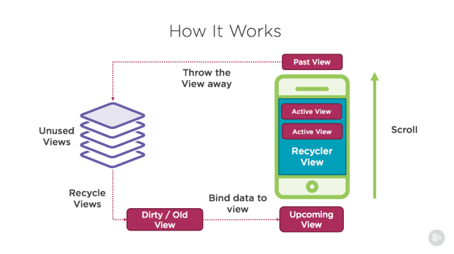

# Build UI For Home Timeline

# Story

### Context
This is our first story build the real page, in this page we should display a post list and every post can tap and navigate to detail page.

### Scope

* Post card content
* Post list
* Post card click navigation
* For simplify the session, we only display three fixed size of images, and doesn't zoom to fit display the images

### Out Of Scope

* Post video and images display
* Link in the post content
* Pull to refresh
* Scroll to load more
* Header and footer toolbar

### Acceptance Criteria

| Given | When | Then |
| :--- | :--- | :--- |
| I as a weibo user | I open the mini weibo app | I can see the post list page(home timeline) |
| I as a weibo user | I land on home page | every post will display: 1. poster avatar, 2. weibo poster name, 3. weibo created datetime, 4. poster source, 5. post content, 6. post images, 7. share\comments\like icons
| I as a weibo user | I click the post | I can goto weibo detail page |

# Read First

* [Create a List with RecyclerView](https://developer.android.com/guide/topics/ui/layout/recyclerview)
* [Create a Card-Based Layout](https://developer.android.com/guide/topics/ui/layout/cardview)
* [Drawable resources](https://developer.android.com/guide/topics/resources/drawable-resource)
* [Layout resource](https://developer.android.com/guide/topics/resources/layout-resource)

Mobile compile with the computer, the most different is the hardware limitation, e.g. screen size, battery, most of app the list display the mass data and use some mobile specific optimization to reduce the CPU and battery usage.

The advantage of RecyclerView is the re-use of Recycler(View), which is a view previously used to display data for a specific adapter position may be placed in a cache for later reuse to display the same type of data again later. This can drastically improve performance by skipping initial layout inflation or construction.

Android provide the adapter: A subclass of RecyclerView.Adapter responsible for providing views that represent items in a data set. you must implement the interface which can make android know which data should display and how many you want to display.

# Practice

* Use the ConstraintLayout to finish the detail page.

> Tips: The layout for detail page is similar with one card in the list page, study [Navigation Pass Data](https://developer.android.com/guide/navigation/navigation-pass-data) first, passing the weibo id to detail page, detail page use this id request the detail information then display them. For detail page layout, you can duplicate the weibo content layout, or extract the weibo content layout then use the [layout include](https://developer.android.com/training/improving-layouts/reusing-layouts).

# Test

When we build the UI of page, most of time we don't use the TDD, so in this story we don't have test cover the UI. in the real project, we use the e2e screen shot test to cover the UI of application.

# Network

Because this story is focus on UI building, so we create the dummy network module in the activity, in the real project, the network module should use DI or ref from global module.